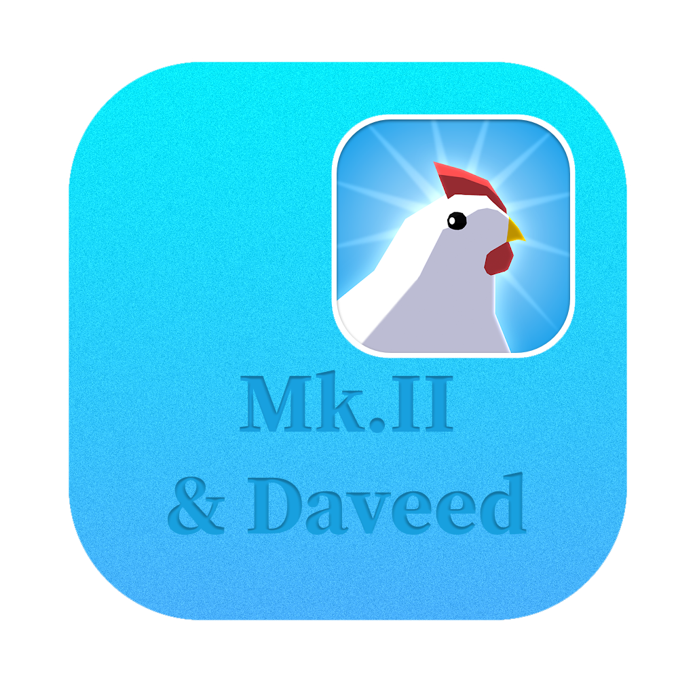

<h1 align="center">
  
</h1>

<p align="center">
  <a href="https://eggledger.davidarthurcole.me/"></a>
  <a href="https://github.com/DavidArthurCole/EggLedger/releases"></a>
  <a href="https://discord.davidarthurcole.me"></a>
</p>

**EggLedger** exports your Egg, Inc. spaceship mission history, including every loot drop, to `.xlsx` and `.csv` so you can slice it however you like. It extends the [rockets tracker](https://wasmegg-carpet.netlify.app/rockets-tracker/), answering the questions that tool can't: "which mission dropped this legendary?" and "how many of this item have I ever pulled?"

## Use it

**EggLedger as a Web app: [eggledger.davidarthurcole.me](https://eggledger.davidarthurcole.me/)**
- Nothing to install.
- (Optionally) Connect to Discord to sync Settings.
- Enter your EID, and pull your data.

This is the recommended way to run EggLedger.<br><br>

Prefer a local app?
**[Download the desktop build](https://github.com/DavidArthurCole/EggLedger/releases)** instead.
- Same features as the web app
- Runs offline, keeps everything on your machine.

## What's "new"

EggLedger was rewritten from Go + Vue to C#. The domain logic, decode, and reports math are validated against the original Go output with golden fixtures, so the numbers match what you had before. The rewrite brought:

- A hosted web app, so you no longer need to download anything to use it.
- A shared UI between web and desktop. Both run on the same Blazor code.
- Native AES-GCM and protobuf decode on every host. No browser engine shipped with the app.

## Security and privacy

**Is my data shared with anyone?**

No. EggLedger talks to the Egg, Inc. API and nothing else, save for an occasional update check against github.com. No analytics, no telemetry, no account info leaves your control. The developer has no way of knowing you even use the tool unless you say so.

**Is there any risk to my account?**

Nothing I'm aware of. The [rockets tracker](https://wasmegg-carpet.netlify.app/rockets-tracker/) has used the same techniques safely for years. That said, none of these tools are sanctioned by the Egg, Inc. developer. Use them at your own risk; I'm not responsible for any fallout.

## License

The MIT License. See COPYING.

## Contributing

Contributions welcome. Fork the repo, make your change, open a pull request.

## Development

EggLedger is a .NET 10 solution. Two hosts share one Razor Class Library (`EggLedger.Web`): the Blazor Server web app (`EggLedger.Web.Server`, the deployed image) and the Photino desktop app (`EggLedger.Desktop`). Pure domain logic lives in `EggLedger.Domain`.

```bash
dotnet build EggLedger.slnx
dotnet test EggLedger.slnx
dotnet publish src/EggLedger.Web.Server -c Release -o out
```