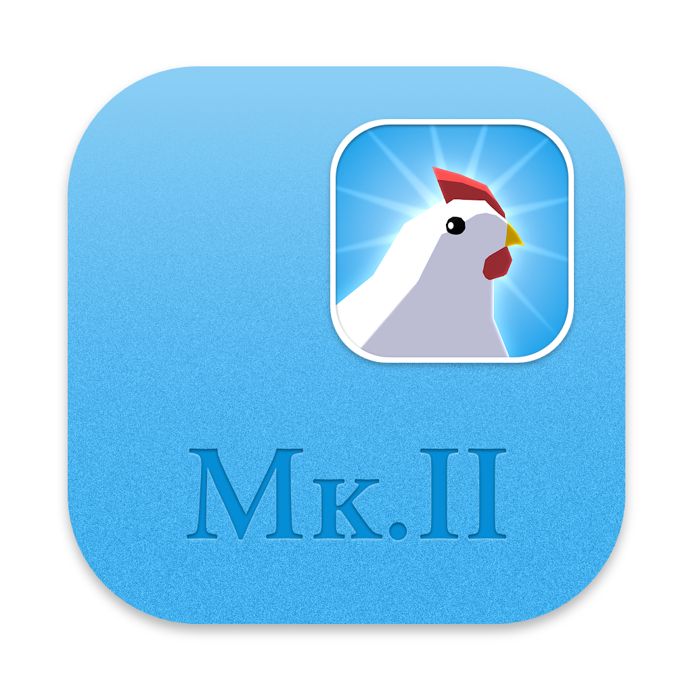

<h1 align="center">
  
</h1>

  
  
  

**EggLedger** helps export your Egg, Inc. spaceship mission data, including loot from each mission, to .xlsx (Excel) and .csv formats for further analysis. It is an extension to the [rockets tracker](https://wasmegg-carpet.netlify.app/rockets-tracker/), answering questions like "from which mission did I obtain this legendary artifact?" and "how many of this item dropped from my ships?" which can't be answered there due to technical or UI limitations.

[**Download now**](https://github.com/DavidArthurCole/EggLedger/releases).

## What's new in 2.0

- **Vue 3 + TypeScript frontend** - the entire UI was rewritten in Vue 3 with TypeScript for better maintainability and type safety.
- **Virtue mission support** - Virtue missions are fetched, displayed, and exported. Mission type filtering and type-column separators are available in the ledger view. Earnings bonus calculations include the Egg of Tomorrow (Virtue/TE) factor.
- **Worker parallelization** - missions are fetched using a configurable number of parallel workers. A rate-limit warning is shown if the interval is too aggressive.
- **Screenshot Safety mode** - a setting to blur EIDs and sensitive data when the app is visible on screen.
- **Per-process progress bars** - each worker shows its own live progress. Menno data download shows phase, bytes downloaded, speed, and ETA.
- **Firefox support** - EggLedger now supports Firefox in addition to Chromium-based browsers. Use the in-app browser selector in Settings to choose your preferred browser.
- **CGO-free build** - the dependency on `go-sqlite3` (which required a C compiler) has been replaced with `modernc.org/sqlite` (pure Go). No MinGW, no C compiler, no WSL required on Windows.

## FAQ

**Windows Defender is blocking the download. What do I do?**

This issue is resolved in 2.0. The previous CGO dependency caused Windows Defender to flag the binary as suspicious due to heuristics around mixed Go/C executables. The 2.0 binary is pure Go and no longer triggers this.

If you are still seeing a Defender warning on an older version, mark your `Ledger` folder as excluded from scans: `Windows Security` -> `Virus & threat protection settings` -> `Manage settings` -> `Exclusions` -> `Add or remove exclusions`.

**Why is EggLedger asking me to install Chrome?**

EggLedger is built on top of `lorca`, an open-source library for building Go apps with a web UI. `lorca` uses a browser as its UI layer. EggLedger supports the following browsers:

- Google Chrome / Chromium
- Brave
- Opera
- Vivaldi
- Microsoft Edge
- Firefox

If EggLedger is launching in the wrong browser, or you would prefer a different one, go to **Settings** in-app and choose from the list of detected browsers.

**Can I run EggLedger on Mobile?**

Short answer, no. The app was designed for desktop use. There is no support for mobile devices.

**Why does it take so long to load my data?**

EggLedger pulls every mission you have ever sent into a local database, which can take a while if you have a large history. Each mission is a separate request to the Egg, Inc. API. To avoid overloading the servers, a rate-limited interval is enforced between requests. You can increase the worker count in Settings to fetch faster, but be conservative - too many parallel requests may trigger API rate limits.

## Security and privacy

**When I use EggLedger, are my data shared with anyone?**

No. EggLedger communicates with the Egg, Inc. API directly - all your data stays local. No analytics are collected by the EggLedger developer. The only third-party requests are the occasional update check against GitHub and an optional download of community drop-rate data from a public endpoint; neither attaches personal data.

**Are there risks to my account if I use EggLedger?**

I'm not aware of any negative effects, and [rockets tracker](https://wasmegg-carpet.netlify.app/rockets-tracker/) has been safely operating with the same techniques for a long time. EggLedger is not sanctioned by the Egg, Inc. developer - use it at your own risk.

*You can find answers to more frequently asked questions in the About tab when you install the app.*

## License

The MIT License. See COPYING.

## Contributing

Contributions are welcome. See [CONTRIBUTING.md](CONTRIBUTING.md) for setup instructions, build steps, and PR conventions.
